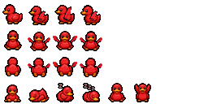

# oneko-smort

A tiny red rubber duck that follows your pointer around the page. It is a
duck-specific adaptation of [oneko.js](https://github.com/adryd325/oneko.js).



## Use it

Add the script before the closing `</body>` tag on your site:

```html
<script src="https://cdn.jsdelivr.net/gh/SmolNero/oneko-smort@main/oneko-smort.js?v=3"></script>
```

The default sprite is loaded from the same directory as the script, so the
single tag is all you need. For a production site, use a tagged release such
as `@v1.0.0` instead of `@main` to pin a stable version. The `?v=3` suffix
prevents browsers from reusing the earlier cached sprite implementation.

To use a different compatible sprite sheet:

```html
<script
  src="https://cdn.jsdelivr.net/gh/SmolNero/oneko-smort@main/oneko-smort.js?v=3"
  data-duck="https://example.com/my-duck.gif"
></script>
```

The duck remembers its last position in local storage. Disable that behavior
when embedding the script with `data-persist-position="false"`.

The animation is automatically disabled when the visitor has enabled
`prefers-reduced-motion`.

## Try it locally

From this directory, run:

```sh
python3 -m http.server 8000
```

Then open <http://localhost:8000> and move your pointer around the page.

## Sprite format

The sprite is a transparent `256 x 128` GIF containing an `8 x 4` grid of
`32 x 32` frames. The movement mapping lives in `spriteSets` in
`oneko-smort.js`. Left-facing movement reuses and mirrors the right-facing
duck frames. JavaScript moves the duck at the display refresh rate while the
sprite animation advances independently, keeping movement smooth. Each running
direction uses a four-frame foot-and-wing cycle, and every occupied cell has
transparent padding to prevent neighboring frames from bleeding into view.

## Credits

The movement engine is adapted from
[adryd325/oneko.js](https://github.com/adryd325/oneko.js), which is based on
the original [Neko desktop accessory](https://en.wikipedia.org/wiki/Neko_(software)).

The project is available under the [MIT License](./LICENSE). The upstream
copyright and license notice are preserved.
